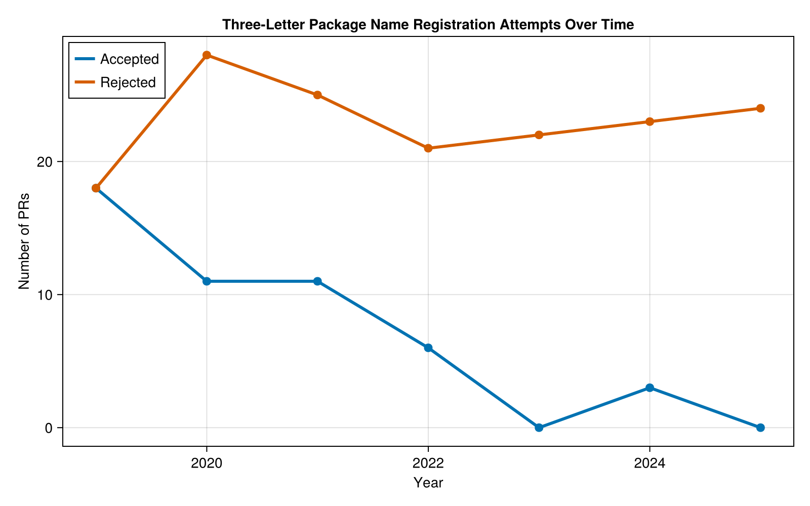
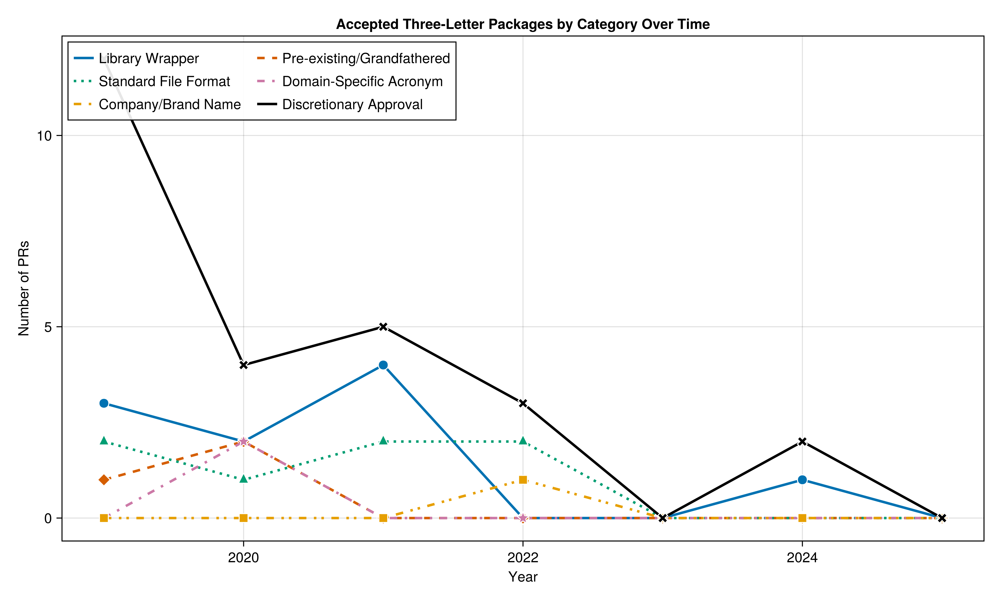

# Three-Letter Package Names in Julia Registry

- **Generated:** 2025-11-12T17:11:28.627
- **Generated by:** [analyze-three-letter-packages.jl](analyze-three-letter-packages.jl)
- **Total 3-letter packages found:** 210

## Summary

- **Merged:** 49
- **Not merged (closed):** 161
- **With analysis:** 210
- **Without analysis:** 0

**Category definitions:** See [categories.md](categories.md) for detailed explanations of each acceptance/rejection category.

## Trends Over Time

### Overall Acceptance Trends

The chart above shows the number of three-letter package name registration attempts per year, split between accepted (blue) and rejected (orange) PRs. Note the dramatic shift in policy - from 50% acceptance in 2019 to near-zero acceptance in recent years.

### Accepted Packages by Category

This chart breaks down the accepted packages by their approval category. The dominant category is "Discretionary Approval" (packages merged without a specific exemption), which was more common in earlier years. Other categories like "Library Wrapper" and "Standard File Format" provide specific justifications for approval.

---

## ✅ Library Wrapper (10)

| Package | PR # | Date | Status | Proof/Evidence | Data | Analysis |
|---------|------|------|--------|----------------|------|----------|
| XRT | [#114380](https://github.com/JuliaRegistries/General/pull/114380) | 2024-09-02 | ✅ Merged | [noblock] Being a wrapper, the name `XRT` seems okay to me, but it will need a manual merge.  Of course, the compat-issues have to be fixed. | [JSON](../data/X/XRT-pr114380.json) | [Analysis](../analysis/X/XRT-pr114380-analysis.json) |
| KLU | [#49410](https://github.com/JuliaRegistries/General/pull/49410) | 2021-11-26 | ✅ Merged | This name is fine since it matches the standard for wrapper packages, i.e. it's wrapping a package called KLU so KLU.jl is the clear choice. Looks like it's just about time for the 3 day mark so I'... | [JSON](../data/K/KLU-pr49410.json) | [Analysis](../analysis/K/KLU-pr49410-analysis.json) |
| FMI | [#37533](https://github.com/JuliaRegistries/General/pull/37533) | 2021-05-26 | ✅ Merged | [noblock]  Dear Julia-Registrator-Team,  I read the guidelines for Julia Package Naming.  I understand, that acronyms should be avoided according to Guideline#1, but "FunctionalMockUpInterfac... | [JSON](../data/F/FMI-pr37533.json) | [Analysis](../analysis/F/FMI-pr37533-analysis.json) |
| ISL | [#37152](https://github.com/JuliaRegistries/General/pull/37152) | 2021-05-20 | ✅ Merged | This is includes the Julia wrappers for the [ISL](http://isl.gforge.inria.fr/) library, and is the front-end package to ISL_jll. As such I don't think there is really a better name and I would like... | [JSON](../data/I/ISL-pr37152.json) | [Analysis](../analysis/I/ISL-pr37152-analysis.json) |
| LKH | [#30852](https://github.com/JuliaRegistries/General/pull/30852) | 2021-02-26 | ✅ Merged | This package is a wrapper of the famous LKH library. http://webhotel4.ruc.dk/~keld/research/LKH/. Hence the name of the package is LKH.jl. | [JSON](../data/L/LKH-pr30852.json) | [Analysis](../analysis/L/LKH-pr30852-analysis.json) |
| XCB | [#23401](https://github.com/JuliaRegistries/General/pull/23401) | 2020-10-21 | ✅ Merged | Library wrapper (wrapper_info.is_wrapper = true) | [JSON](../data/X/XCB-pr23401.json) | [Analysis](../analysis/X/XCB-pr23401-analysis.json) |
| MKL | [#22878](https://github.com/JuliaRegistries/General/pull/22878) | 2020-10-13 | ✅ Merged | Intel MKL linear algebra backend for Julia | [JSON](../data/M/MKL-pr22878.json) | [Analysis](../analysis/M/MKL-pr22878-analysis.json) |
| LSL | [#4256](https://github.com/JuliaRegistries/General/pull/4256) | 2019-10-10 | ✅ Merged | Can you retrigger to resolve the conflict? Also, how about calling this `LabStreamingLayer` (`LabStreamingLayers`?)  Edit: nvm, this was wrapping a lsl library. | [JSON](../data/L/LSL-pr4256.json) | [Analysis](../analysis/L/LSL-pr4256-analysis.json) |
| ITK | [#2661](https://github.com/JuliaRegistries/General/pull/2661) | 2019-08-13 | ✅ Merged | Regarding the name being an acronym, this is a wrapper for the ITK package https://itk.org.  | [JSON](../data/I/ITK-pr2661.json) | [Analysis](../analysis/I/ITK-pr2661-analysis.json) |
| HSL | [#497](https://github.com/JuliaRegistries/General/pull/497) | 2019-05-02 | ✅ Merged | Julia interface to the HSL Mathematical Software Library | [JSON](../data/H/HSL-pr497.json) | [Analysis](../analysis/H/HSL-pr497-analysis.json) |

## ✅ Pre-existing/Grandfathered (3)

| Package | PR # | Date | Status | Proof/Evidence | Data | Analysis |
|---------|------|------|--------|----------------|------|----------|
| AWS | [#20506](https://github.com/JuliaRegistries/General/pull/20506) | 2020-08-29 | ✅ Merged | This package should be exempt to the 5 letter rule as it is a pre-existing package with a name from long before that guideline that is only now being updated to be Julia 1.0 compatible. | [JSON](../data/A/AWS-pr20506.json) | [Analysis](../analysis/A/AWS-pr20506-analysis.json) |
| QML | [#18516](https://github.com/JuliaRegistries/General/pull/18516) | 2020-07-27 | ✅ Merged | The version is 0.6 because the package existed before in the old registry | [JSON](../data/Q/QML-pr18516.json) | [Analysis](../analysis/Q/QML-pr18516-analysis.json) |
| SMC | [#2892](https://github.com/JuliaRegistries/General/pull/2892) | 2019-08-23 | ✅ Merged | Although the name is perhaps not ideal, we've already committed to it for other reasons so we'd like to merge as is with the current name. | [JSON](../data/S/SMC-pr2892.json) | [Analysis](../analysis/S/SMC-pr2892-analysis.json) |

## ✅ Standard File Format (7)

| Package | PR # | Date | Status | Proof/Evidence | Data | Analysis |
|---------|------|------|--------|----------------|------|----------|
| KML | [#61044](https://github.com/JuliaRegistries/General/pull/61044) | 2022-05-25 | ✅ Merged | Standard file format package | [JSON](../data/K/KML-pr61044.json) | [Analysis](../analysis/K/KML-pr61044-analysis.json) |
| XML | [#58359](https://github.com/JuliaRegistries/General/pull/58359) | 2022-04-11 | ✅ Merged | Standard file format package | [JSON](../data/X/XML-pr58359.json) | [Analysis](../analysis/X/XML-pr58359-analysis.json) |
| QOI | [#51291](https://github.com/JuliaRegistries/General/pull/51291) | 2021-12-27 | ✅ Merged | QOI is the file format and other packages in other languages uses that name so I think it is justified. | [JSON](../data/Q/QOI-pr51291.json) | [Analysis](../analysis/Q/QOI-pr51291-analysis.json) |
| PWF | [#49190](https://github.com/JuliaRegistries/General/pull/49190) | 2021-11-22 | ✅ Merged | PWF.jl is a package exclusively dedicated to reading '.PWF' files, which is the extension used in the Brazilian Power System's cases. Like CSV.jl, which is dedicated to read/parse CSV files into Julia, PWF.jl would like to be registered exactly like the file extension name. | [JSON](../data/P/PWF-pr49190.json) | [Analysis](../analysis/P/PWF-pr49190-analysis.json) |
| XDF | [#20235](https://github.com/JuliaRegistries/General/pull/20235) | 2020-08-26 | ✅ Merged | This package provides support for reading XDF files. Since it seems to be common practice to name such packages after the file format they support, I would like to keep the name XDF.jl | [JSON](../data/X/XDF-pr20235.json) | [Analysis](../analysis/X/XDF-pr20235-analysis.json) |
| Tar | [#6450](https://github.com/JuliaRegistries/General/pull/6450) | 2019-12-09 | ✅ Merged | Decided to go with the conservative option and register Tar.jl now with a 0.1 version number. The intention is that it can include broader functionality in the future | [JSON](../data/T/Tar-pr6450.json) | [Analysis](../analysis/T/Tar-pr6450-analysis.json) |
| EDF | [#3650](https://github.com/JuliaRegistries/General/pull/3650) | 2019-09-18 | ✅ Merged | Package handles EDF (European Data Format), a widely-recognized standard file format for storing physiological signals and medical data | [JSON](../data/E/EDF-pr3650.json) | [Analysis](../analysis/E/EDF-pr3650-analysis.json) |

## ✅ Domain-Specific Acronym (2)

| Package | PR # | Date | Status | Proof/Evidence | Data | Analysis |
|---------|------|------|--------|----------------|------|----------|
| ADI | [#19070](https://github.com/JuliaRegistries/General/pull/19070) | 2020-08-06 | ✅ Merged | Justification: domain_specific_acronym | [JSON](../data/A/ADI-pr19070.json) | [Analysis](../analysis/A/ADI-pr19070-analysis.json) |
| AES | [#13857](https://github.com/JuliaRegistries/General/pull/13857) | 2020-04-29 | ✅ Merged | In crypto scenario, AES is well known thing, rather than Advanced Encryption Standard. I feel AES should be good | [JSON](../data/A/AES-pr13857.json) | [Analysis](../analysis/A/AES-pr13857-analysis.json) |

## ✅ Company/Brand Name (1)

| Package | PR # | Date | Status | Proof/Evidence | Data | Analysis |
|---------|------|------|--------|----------------|------|----------|
| RAI | [#57692](https://github.com/JuliaRegistries/General/pull/57692) | 2022-03-31 | ✅ Merged | We use the acronym RAI to brand all of our developer materials, including all language SDKs. Our users appreciate the consistency and we think it is more "developer friendly" than using the relativ... | [JSON](../data/R/RAI-pr57692.json) | [Analysis](../analysis/R/RAI-pr57692-analysis.json) |

## ✅ Discretionary Approval (26)

| Package | PR # | Date | Status | Proof/Evidence | Data | Analysis |
|---------|------|------|--------|----------------|------|----------|
| CAP | [#118365](https://github.com/JuliaRegistries/General/pull/118365) | 2024-10-30 | ✅ Merged | Merged without specific exemption | [JSON](../data/C/CAP-pr118365.json) | [Analysis](../analysis/C/CAP-pr118365-analysis.json) |
| Ket | [#110011](https://github.com/JuliaRegistries/General/pull/110011) | 2024-06-28 | ✅ Merged | Merged without specific exemption | [JSON](../data/K/Ket-pr110011.json) | [Analysis](../analysis/K/Ket-pr110011-analysis.json) |
| Lux | [#59605](https://github.com/JuliaRegistries/General/pull/59605) | 2022-05-03 | ✅ Merged | Merged without specific exemption | [JSON](../data/L/Lux-pr59605.json) | [Analysis](../analysis/L/Lux-pr59605-analysis.json) |
| Try | [#57060](https://github.com/JuliaRegistries/General/pull/57060) | 2022-03-22 | ✅ Merged | Merged without specific exemption | [JSON](../data/T/Try-pr57060.json) | [Analysis](../analysis/T/Try-pr57060-analysis.json) |
| QSM | [#54243](https://github.com/JuliaRegistries/General/pull/54243) | 2022-02-09 | ✅ Merged | Merged without specific exemption | [JSON](../data/Q/QSM-pr54243.json) | [Analysis](../analysis/Q/QSM-pr54243-analysis.json) |
| Jin | [#49720](https://github.com/JuliaRegistries/General/pull/49720) | 2021-12-01 | ✅ Merged | Merged without specific exemption | [JSON](../data/J/Jin-pr49720.json) | [Analysis](../analysis/J/Jin-pr49720-analysis.json) |
| Mex | [#47975](https://github.com/JuliaRegistries/General/pull/47975) | 2021-11-02 | ✅ Merged | Merged without specific exemption | [JSON](../data/M/Mex-pr47975.json) | [Analysis](../analysis/M/Mex-pr47975-analysis.json) |
| Air | [#47025](https://github.com/JuliaRegistries/General/pull/47025) | 2021-10-19 | ✅ Merged | Merged without specific exemption | [JSON](../data/A/Air-pr47025.json) | [Analysis](../analysis/A/Air-pr47025-analysis.json) |
| JET | [#33580](https://github.com/JuliaRegistries/General/pull/33580) | 2021-04-05 | ✅ Merged | Merged without specific exemption | [JSON](../data/J/JET-pr33580.json) | [Analysis](../analysis/J/JET-pr33580-analysis.json) |
| UCX | [#28878](https://github.com/JuliaRegistries/General/pull/28878) | 2021-01-28 | ✅ Merged | Merged without specific exemption | [JSON](../data/U/UCX-pr28878.json) | [Analysis](../analysis/U/UCX-pr28878-analysis.json) |
| ROS | [#26943](https://github.com/JuliaRegistries/General/pull/26943) | 2020-12-26 | ✅ Merged | Merged without specific exemption | [JSON](../data/R/ROS-pr26943.json) | [Analysis](../analysis/R/ROS-pr26943-analysis.json) |
| FIB | [#21383](https://github.com/JuliaRegistries/General/pull/21383) | 2020-09-14 | ✅ Merged | Merged without specific exemption | [JSON](../data/F/FIB-pr21383.json) | [Analysis](../analysis/F/FIB-pr21383-analysis.json) |
| Run | [#18563](https://github.com/JuliaRegistries/General/pull/18563) | 2020-07-28 | ✅ Merged | Merged without specific exemption | [JSON](../data/R/Run-pr18563.json) | [Analysis](../analysis/R/Run-pr18563-analysis.json) |
| Gen | [#15310](https://github.com/JuliaRegistries/General/pull/15310) | 2020-05-24 | ✅ Merged | Merged without specific exemption | [JSON](../data/G/Gen-pr15310.json) | [Analysis](../analysis/G/Gen-pr15310-analysis.json) |
| Fri | [#5330](https://github.com/JuliaRegistries/General/pull/5330) | 2019-11-12 | ✅ Merged | Merged without specific exemption | [JSON](../data/F/Fri-pr5330.json) | [Analysis](../analysis/F/Fri-pr5330-analysis.json) |
| JDF | [#3542](https://github.com/JuliaRegistries/General/pull/3542) | 2019-09-15 | ✅ Merged | Merged without discussion (0 comments, 2019) | [JSON](../data/J/JDF-pr3542.json) | [Analysis](../analysis/J/JDF-pr3542-analysis.json) |
| NES | [#3549](https://github.com/JuliaRegistries/General/pull/3549) | 2019-09-15 | ✅ Merged | Merged without specific exemption | [JSON](../data/N/NES-pr3549.json) | [Analysis](../analysis/N/NES-pr3549-analysis.json) |
| VQC | [#3322](https://github.com/JuliaRegistries/General/pull/3322) | 2019-09-06 | ✅ Merged | Merged without specific exemption | [JSON](../data/V/VQC-pr3322.json) | [Analysis](../analysis/V/VQC-pr3322-analysis.json) |
| Glo | [#3291](https://github.com/JuliaRegistries/General/pull/3291) | 2019-09-05 | ✅ Merged | Merged without specific exemption | [JSON](../data/G/Glo-pr3291.json) | [Analysis](../analysis/G/Glo-pr3291-analysis.json) |
| Org | [#2292](https://github.com/JuliaRegistries/General/pull/2292) | 2019-07-25 | ✅ Merged | Merged without specific exemption | [JSON](../data/O/Org-pr2292.json) | [Analysis](../analysis/O/Org-pr2292-analysis.json) |
| Amb | [#2054](https://github.com/JuliaRegistries/General/pull/2054) | 2019-07-16 | ✅ Merged | Merged without specific exemption | [JSON](../data/A/Amb-pr2054.json) | [Analysis](../analysis/A/Amb-pr2054-analysis.json) |
| SMM | [#1536](https://github.com/JuliaRegistries/General/pull/1536) | 2019-06-24 | ✅ Merged | Merged without specific exemption | [JSON](../data/S/SMM-pr1536.json) | [Analysis](../analysis/S/SMM-pr1536-analysis.json) |
| Ant | [#1095](https://github.com/JuliaRegistries/General/pull/1095) | 2019-05-31 | ✅ Merged | Merged without specific exemption | [JSON](../data/A/Ant-pr1095.json) | [Analysis](../analysis/A/Ant-pr1095-analysis.json) |
| GAP | [#893](https://github.com/JuliaRegistries/General/pull/893) | 2019-05-21 | ✅ Merged | Merged without specific exemption | [JSON](../data/G/GAP-pr893.json) | [Analysis](../analysis/G/GAP-pr893-analysis.json) |
| FCA | [#482](https://github.com/JuliaRegistries/General/pull/482) | 2019-05-01 | ✅ Merged | Merged without specific exemption | [JSON](../data/F/FCA-pr482.json) | [Analysis](../analysis/F/FCA-pr482-analysis.json) |
| TCX | [#134](https://github.com/JuliaRegistries/General/pull/134) | 2019-04-19 | ✅ Merged | Merged without discussion (0 comments, 2018) | [JSON](../data/T/TCX-pr134.json) | [Analysis](../analysis/T/TCX-pr134-analysis.json) |

## ❌ Duplicate/Superseded PR (69)

| Package | PR # | Date | Status | Proof/Evidence | Data | Analysis |
|---------|------|------|--------|----------------|------|----------|
| Ark | [#141716](https://github.com/JuliaRegistries/General/pull/141716) | 2025-11-03 | ❌ Closed | Closed in favor of  #141718. | [JSON](../data/A/Ark-pr141716.json) | [Analysis](../analysis/A/Ark-pr141716-analysis.json) |
| UFF | [#141602](https://github.com/JuliaRegistries/General/pull/141602) | 2025-10-31 | ❌ Closed | Closing in favor of https://github.com/JuliaRegistries/General/pull/141659 | [JSON](../data/U/UFF-pr141602.json) | [Analysis](../analysis/U/UFF-pr141602-analysis.json) |
| GMC | [#141330](https://github.com/JuliaRegistries/General/pull/141330) | 2025-10-27 | ❌ Closed | Closing in favor of https://github.com/JuliaRegistries/General/pull/141340 | [JSON](../data/G/GMC-pr141330.json) | [Analysis](../analysis/G/GMC-pr141330-analysis.json) |
| DDA | [#141073](https://github.com/JuliaRegistries/General/pull/141073) | 2025-10-23 | ❌ Closed | Closing in favor of https://github.com/JuliaRegistries/General/pull/141075 | [JSON](../data/D/DDA-pr141073.json) | [Analysis](../analysis/D/DDA-pr141073-analysis.json) |
| KIM | [#138607](https://github.com/JuliaRegistries/General/pull/138607) | 2025-09-15 | ❌ Closed | Closing in favor of https://github.com/JuliaRegistries/General/pull/138615 | [JSON](../data/K/KIM-pr138607.json) | [Analysis](../analysis/K/KIM-pr138607-analysis.json) |
| CAN | [#138069](https://github.com/JuliaRegistries/General/pull/138069) | 2025-09-06 | ❌ Closed | Closing in favor of https://github.com/JuliaRegistries/General/pull/138081 | [JSON](../data/C/CAN-pr138069.json) | [Analysis](../analysis/C/CAN-pr138069-analysis.json) |
| GSD | [#137160](https://github.com/JuliaRegistries/General/pull/137160) | 2025-08-22 | ❌ Closed | Closing in favor of https://github.com/JuliaRegistries/General/pull/137164 | [JSON](../data/G/GSD-pr137160.json) | [Analysis](../analysis/G/GSD-pr137160-analysis.json) |
| GSD | [#137161](https://github.com/JuliaRegistries/General/pull/137161) | 2025-08-22 | ❌ Closed | Closing in favor of https://github.com/JuliaRegistries/General/pull/137164 | [JSON](../data/G/GSD-pr137161.json) | [Analysis](../analysis/G/GSD-pr137161-analysis.json) |
| ACS | [#133925](https://github.com/JuliaRegistries/General/pull/133925) | 2025-06-30 | ❌ Closed | Closed in favor of https://github.com/JuliaRegistries/General/pull/134035 | [JSON](../data/A/ACS-pr133925.json) | [Analysis](../analysis/A/ACS-pr133925-analysis.json) |
| BLR | [#133417](https://github.com/JuliaRegistries/General/pull/133417) | 2025-06-22 | ❌ Closed | Closing in favor of https://github.com/JuliaRegistries/General/pull/133453 | [JSON](../data/B/BLR-pr133417.json) | [Analysis](../analysis/B/BLR-pr133417-analysis.json) |
| RMA | [#132909](https://github.com/JuliaRegistries/General/pull/132909) | 2025-06-14 | ❌ Closed | Closing in favor of https://github.com/JuliaRegistries/General/pull/133125 | [JSON](../data/R/RMA-pr132909.json) | [Analysis](../analysis/R/RMA-pr132909-analysis.json) |
| GIV | [#131666](https://github.com/JuliaRegistries/General/pull/131666) | 2025-05-24 | ❌ Closed | Closing in favor of https://github.com/JuliaRegistries/General/pull/131667 | [JSON](../data/G/GIV-pr131666.json) | [Analysis](../analysis/G/GIV-pr131666-analysis.json) |
| GIV | [#130992](https://github.com/JuliaRegistries/General/pull/130992) | 2025-05-14 | ❌ Closed | Closing in favor of https://github.com/JuliaRegistries/General/pull/131667 | [JSON](../data/G/GIV-pr130992.json) | [Analysis](../analysis/G/GIV-pr130992-analysis.json) |
| CDR | [#130021](https://github.com/JuliaRegistries/General/pull/130021) | 2025-04-29 | ❌ Closed | Closing in favor of https://github.com/JuliaRegistries/General/pull/130030 | [JSON](../data/C/CDR-pr130021.json) | [Analysis](../analysis/C/CDR-pr130021-analysis.json) |
| CDR | [#130029](https://github.com/JuliaRegistries/General/pull/130029) | 2025-04-29 | ❌ Closed | Closing in favor of https://github.com/JuliaRegistries/General/pull/130030 | [JSON](../data/C/CDR-pr130029.json) | [Analysis](../analysis/C/CDR-pr130029-analysis.json) |
| JAC | [#129915](https://github.com/JuliaRegistries/General/pull/129915) | 2025-04-28 | ❌ Closed | Closing in favor of https://github.com/JuliaRegistries/General/pull/132032  Thank you for re-registering! This looks great! | [JSON](../data/J/JAC-pr129915.json) | [Analysis](../analysis/J/JAC-pr129915-analysis.json) |
| RAG | [#124630](https://github.com/JuliaRegistries/General/pull/124630) | 2025-02-09 | ❌ Closed | STOP! This is duplicative and no longer needed. This was a package rename due to the reported name similarity: https://github.com/JuliaRegistries/General/pull/124608... Please close this one | [JSON](../data/R/RAG-pr124630.json) | [Analysis](../analysis/R/RAG-pr124630-analysis.json) |
| ROJ | [#124209](https://github.com/JuliaRegistries/General/pull/124209) | 2025-02-02 | ❌ Closed | Closing in favor of https://github.com/JuliaRegistries/General/pull/124282 | [JSON](../data/R/ROJ-pr124209.json) | [Analysis](../analysis/R/ROJ-pr124209-analysis.json) |
| EDA | [#122416](https://github.com/JuliaRegistries/General/pull/122416) | 2025-01-05 | ❌ Closed | Closing in favor of https://github.com/JuliaRegistries/General/pull/122422 | [JSON](../data/E/EDA-pr122416.json) | [Analysis](../analysis/E/EDA-pr122416-analysis.json) |
| EDA | [#122417](https://github.com/JuliaRegistries/General/pull/122417) | 2025-01-05 | ❌ Closed | Closing in favor of https://github.com/JuliaRegistries/General/pull/122422 | [JSON](../data/E/EDA-pr122417.json) | [Analysis](../analysis/E/EDA-pr122417-analysis.json) |
| CAT | [#121157](https://github.com/JuliaRegistries/General/pull/121157) | 2024-12-10 | ❌ Closed | We decided to name the package CATrustRegionMethod and we included in the package readme an explanation of the name. We opened another pull request. Can you please close this pull request. | [JSON](../data/C/CAT-pr121157.json) | [Analysis](../analysis/C/CAT-pr121157-analysis.json) |
| JiL | [#120571](https://github.com/JuliaRegistries/General/pull/120571) | 2024-12-03 | ❌ Closed | Closed in favor of #120583. | [JSON](../data/J/JiL-pr120571.json) | [Analysis](../analysis/J/JiL-pr120571-analysis.json) |
| HSM | [#120480](https://github.com/JuliaRegistries/General/pull/120480) | 2024-12-01 | ❌ Closed | Closing in favor of https://github.com/JuliaRegistries/General/pull/120505 | [JSON](../data/H/HSM-pr120480.json) | [Analysis](../analysis/H/HSM-pr120480-analysis.json) |
| L2O | [#116709](https://github.com/JuliaRegistries/General/pull/116709) | 2024-10-06 | ❌ Closed | closing in favor of https://github.com/JuliaRegistries/General/pull/117171 which uses the proposed name 👍  | [JSON](../data/L/L2O-pr116709.json) | [Analysis](../analysis/L/L2O-pr116709-analysis.json) |
| Daf | [#115545](https://github.com/JuliaRegistries/General/pull/115545) | 2024-09-20 | ❌ Closed | Closing in favor of https://github.com/JuliaRegistries/General/pull/115553 | [JSON](../data/D/Daf-pr115545.json) | [Analysis](../analysis/D/Daf-pr115545-analysis.json) |
| QED | [#114341](https://github.com/JuliaRegistries/General/pull/114341) | 2024-09-02 | ❌ Closed | Followup in https://github.com/JuliaRegistries/General/pull/115082 | [JSON](../data/Q/QED-pr114341.json) | [Analysis](../analysis/Q/QED-pr114341-analysis.json) |
| SSM | [#113737](https://github.com/JuliaRegistries/General/pull/113737) | 2024-08-23 | ❌ Closed | Closing in favor of https://github.com/JuliaRegistries/General/pull/113748 | [JSON](../data/S/SSM-pr113737.json) | [Analysis](../analysis/S/SSM-pr113737-analysis.json) |
| gsd | [#109760](https://github.com/JuliaRegistries/General/pull/109760) | 2024-06-25 | ❌ Closed | Closing in favor of https://github.com/JuliaRegistries/General/pull/110152 | [JSON](../data/G/gsd-pr109760.json) | [Analysis](../analysis/G/gsd-pr109760-analysis.json) |
| LAS | [#109630](https://github.com/JuliaRegistries/General/pull/109630) | 2024-06-23 | ❌ Closed | Closing in favor of https://github.com/JuliaRegistries/General/pull/109635 | [JSON](../data/L/LAS-pr109630.json) | [Analysis](../analysis/L/LAS-pr109630-analysis.json) |
| LAS | [#109631](https://github.com/JuliaRegistries/General/pull/109631) | 2024-06-23 | ❌ Closed | Closing in favor of https://github.com/JuliaRegistries/General/pull/109635 | [JSON](../data/L/LAS-pr109631.json) | [Analysis](../analysis/L/LAS-pr109631-analysis.json) |
| BCB | [#102907](https://github.com/JuliaRegistries/General/pull/102907) | 2024-03-15 | ❌ Closed | Closing in favor of https://github.com/JuliaRegistries/General/pull/102910 | [JSON](../data/B/BCB-pr102907.json) | [Analysis](../analysis/B/BCB-pr102907-analysis.json) |
| Jib | [#102601](https://github.com/JuliaRegistries/General/pull/102601) | 2024-03-10 | ❌ Closed | See https://github.com/JuliaRegistries/General/pull/101999 | [JSON](../data/J/Jib-pr102601.json) | [Analysis](../analysis/J/Jib-pr102601-analysis.json) |
| SPM | [#96039](https://github.com/JuliaRegistries/General/pull/96039) | 2023-11-27 | ❌ Closed | Please delete this pull request. I renamed the package and opened another pull request which fixes the AutoMerge issues (#96045). | [JSON](../data/S/SPM-pr96039.json) | [Analysis](../analysis/S/SPM-pr96039-analysis.json) |
| AME | [#93079](https://github.com/JuliaRegistries/General/pull/93079) | 2023-10-09 | ❌ Closed | This is superseded by https://github.com/JuliaRegistries/General/pull/93281.  | [JSON](../data/A/AME-pr93079.json) | [Analysis](../analysis/A/AME-pr93079-analysis.json) |
| Sky | [#92375](https://github.com/JuliaRegistries/General/pull/92375) | 2023-09-28 | ❌ Closed | Author: 'since the package name changed it has triggered a new pull request... This can then be closed as it is no longer relevant' | [JSON](../data/S/Sky-pr92375.json) | [Analysis](../analysis/S/Sky-pr92375-analysis.json) |
| Pad | [#91451](https://github.com/JuliaRegistries/General/pull/91451) | 2023-09-14 | ❌ Closed | Superseded by https://github.com/JuliaRegistries/General/pull/91460 | [JSON](../data/P/Pad-pr91451.json) | [Analysis](../analysis/P/Pad-pr91451-analysis.json) |
| SML | [#74719](https://github.com/JuliaRegistries/General/pull/74719) | 2022-12-28 | ❌ Closed | Replaced by #74936 | [JSON](../data/S/SML-pr74719.json) | [Analysis](../analysis/S/SML-pr74719-analysis.json) |
| fet | [#73423](https://github.com/JuliaRegistries/General/pull/73423) | 2022-12-04 | ❌ Closed | I want to prevent this pull request from being merged, because I've made a few modification for full compliance of Automerge guideline. See pull request here: https://github.com/JuliaRegistries/General/pull/73425 | [JSON](../data/F/fet-pr73423.json) | [Analysis](../analysis/F/fet-pr73423-analysis.json) |
| Phy | [#71256](https://github.com/JuliaRegistries/General/pull/71256) | 2022-10-28 | ❌ Closed | Presumably superseded by #71262 | [JSON](../data/P/Phy-pr71256.json) | [Analysis](../analysis/P/Phy-pr71256-analysis.json) |
| RSA | [#71070](https://github.com/JuliaRegistries/General/pull/71070) | 2022-10-26 | ❌ Closed | Presumably superseded by #71071 | [JSON](../data/R/RSA-pr71070.json) | [Analysis](../analysis/R/RSA-pr71070-analysis.json) |
| ESA | [#68432](https://github.com/JuliaRegistries/General/pull/68432) | 2022-09-16 | ❌ Closed | Presumably superseded by #68433  | [JSON](../data/E/ESA-pr68432.json) | [Analysis](../analysis/E/ESA-pr68432-analysis.json) |
| Hop | [#61625](https://github.com/JuliaRegistries/General/pull/61625) | 2022-06-03 | ❌ Closed | I am changing the package name to HopTB. This pull request can be closed. | [JSON](../data/H/Hop-pr61625.json) | [Analysis](../analysis/H/Hop-pr61625-analysis.json) |
| QTL | [#61632](https://github.com/JuliaRegistries/General/pull/61632) | 2022-06-03 | ❌ Closed | Presumably superseded by  #61644 | [JSON](../data/Q/QTL-pr61632.json) | [Analysis](../analysis/Q/QTL-pr61632-analysis.json) |
| Tag | [#60993](https://github.com/JuliaRegistries/General/pull/60993) | 2022-05-25 | ❌ Closed | This pull request should be closed. The new name is TagPOMDPProblem.jl | [JSON](../data/T/Tag-pr60993.json) | [Analysis](../analysis/T/Tag-pr60993-analysis.json) |
| Nur | [#60608](https://github.com/JuliaRegistries/General/pull/60608) | 2022-05-20 | ❌ Closed | Please close this, changed name. | [JSON](../data/N/Nur-pr60608.json) | [Analysis](../analysis/N/Nur-pr60608-analysis.json) |
| Mia | [#56707](https://github.com/JuliaRegistries/General/pull/56707) | 2022-03-16 | ❌ Closed | Hi! I opened a [pull request](https://github.com/JuliaRegistries/General/pull/56931) with the new package name. This one can be safely closed. | [JSON](../data/M/Mia-pr56707.json) | [Analysis](../analysis/M/Mia-pr56707-analysis.json) |
| PWF | [#49160](https://github.com/JuliaRegistries/General/pull/49160) | 2021-11-22 | ❌ Closed | I'm assuming this is superseded by #49190 | [JSON](../data/P/PWF-pr49160.json) | [Analysis](../analysis/P/PWF-pr49160-analysis.json) |
| XPS | [#44499](https://github.com/JuliaRegistries/General/pull/44499) | 2021-09-08 | ❌ Closed | Renamed this package to ExpressCommands.jl, see #44522, this PR can be closed | [JSON](../data/X/XPS-pr44499.json) | [Analysis](../analysis/X/XPS-pr44499-analysis.json) |
| Rua | [#43837](https://github.com/JuliaRegistries/General/pull/43837) | 2021-08-31 | ❌ Closed | I have updated the mentioned in another pull request #45913 | [JSON](../data/R/Rua-pr43837.json) | [Analysis](../analysis/R/Rua-pr43837-analysis.json) |
| FNV | [#43434](https://github.com/JuliaRegistries/General/pull/43434) | 2021-08-24 | ❌ Closed | Added under different name `FNVHash`. Please close this. | [JSON](../data/F/FNV-pr43434.json) | [Analysis](../analysis/F/FNV-pr43434-analysis.json) |
| ABC | [#36177](https://github.com/JuliaRegistries/General/pull/36177) | 2021-05-06 | ❌ Closed | Closing the PR to rename pkg to BerkeleyABC | [JSON](../data/A/ABC-pr36177.json) | [Analysis](../analysis/A/ABC-pr36177-analysis.json) |
| Dbg | [#33430](https://github.com/JuliaRegistries/General/pull/33430) | 2021-04-02 | ❌ Closed | This PR is superseded by #33446 and can be closed: I renamed `Dbg` -> `DbgMacro`. | [JSON](../data/D/Dbg-pr33430.json) | [Analysis](../analysis/D/Dbg-pr33430-analysis.json) |
| DCI | [#32931](https://github.com/JuliaRegistries/General/pull/32931) | 2021-03-26 | ❌ Closed | Superseded by #33426 (`DCISolver.jl`) | [JSON](../data/D/DCI-pr32931.json) | [Analysis](../analysis/D/DCI-pr32931-analysis.json) |
| Jay | [#31814](https://github.com/JuliaRegistries/General/pull/31814) | 2021-03-12 | ❌ Closed | I will close this one then in favor of the new one: https://github.com/JuliaRegistries/General/pull/32270 | [JSON](../data/J/Jay-pr31814.json) | [Analysis](../analysis/J/Jay-pr31814-analysis.json) |
| VCF | [#30036](https://github.com/JuliaRegistries/General/pull/30036) | 2021-02-14 | ❌ Closed | This pull request is no longer valid. I'm changing the name of the package to `VariantCallFormat.jl`. | [JSON](../data/V/VCF-pr30036.json) | [Analysis](../analysis/V/VCF-pr30036-analysis.json) |
| BDD | [#19448](https://github.com/JuliaRegistries/General/pull/19448) | 2020-08-13 | ❌ Closed | This package was merged in on PR #25646 with the discussed changes in naming. | [JSON](../data/B/BDD-pr19448.json) | [Analysis](../analysis/B/BDD-pr19448-analysis.json) |
| Fzf | [#17451](https://github.com/JuliaRegistries/General/pull/17451) | 2020-07-04 | ❌ Closed | replaced by https://github.com/Moelf/JLFzf.jl/commit/c5d0ad90f7bd12b3de14a7596bcdc822b069229f | [JSON](../data/F/Fzf-pr17451.json) | [Analysis](../analysis/F/Fzf-pr17451-analysis.json) |
| UHD | [#12621](https://github.com/JuliaRegistries/General/pull/12621) | 2020-04-09 | ❌ Closed | To be removed (compat and version issue solved in #13074) | [JSON](../data/U/UHD-pr12621.json) | [Analysis](../analysis/U/UHD-pr12621-analysis.json) |
| XDG | [#12376](https://github.com/JuliaRegistries/General/pull/12376) | 2020-04-06 | ❌ Closed | This is fixed in #12377 | [JSON](../data/X/XDG-pr12376.json) | [Analysis](../analysis/X/XDG-pr12376-analysis.json) |
| GAS | [#8805](https://github.com/JuliaRegistries/General/pull/8805) | 2020-02-03 | ❌ Closed | This should be closed, it was replaced by #8844 | [JSON](../data/G/GAS-pr8805.json) | [Analysis](../analysis/G/GAS-pr8805-analysis.json) |
| RPH | [#8431](https://github.com/JuliaRegistries/General/pull/8431) | 2020-01-25 | ❌ Closed | Package was renamed to RandomizedProgressiveHedging.jl, resulting in a [different PR](https://github.com/JuliaRegistries/General/pull/8432). This PR can be discarded, sorry about the duplicate... | [JSON](../data/R/RPH-pr8431.json) | [Analysis](../analysis/R/RPH-pr8431-analysis.json) |
| GPJ | [#7664](https://github.com/JuliaRegistries/General/pull/7664) | 2020-01-08 | ❌ Closed | This PR is created by a mistake (dup https://github.com/JuliaRegistries/General/pull/7661). Pls, feel free to close it. | [JSON](../data/G/GPJ-pr7664.json) | [Analysis](../analysis/G/GPJ-pr7664-analysis.json) |
| SDD | [#7062](https://github.com/JuliaRegistries/General/pull/7062) | 2019-12-22 | ❌ Closed | Closing in favor of #7877  | [JSON](../data/S/SDD-pr7062.json) | [Analysis](../analysis/S/SDD-pr7062-analysis.json) |
| Tar | [#6286](https://github.com/JuliaRegistries/General/pull/6286) | 2019-12-05 | ❌ Closed | Superseded by https://github.com/JuliaRegistries/General/pull/6450. | [JSON](../data/T/Tar-pr6286.json) | [Analysis](../analysis/T/Tar-pr6286-analysis.json) |
| Sim | [#5038](https://github.com/JuliaRegistries/General/pull/5038) | 2019-11-04 | ❌ Closed | name change done to Simulate.jl, compat entries added | [JSON](../data/S/Sim-pr5038.json) | [Analysis](../analysis/S/Sim-pr5038-analysis.json) |
| AML | [#4773](https://github.com/JuliaRegistries/General/pull/4773) | 2019-10-26 | ❌ Closed | Closed per https://github.com/JuliaRegistries/General/pull/4666#issuecomment-547597973 | [JSON](../data/A/AML-pr4773.json) | [Analysis](../analysis/A/AML-pr4773-analysis.json) |
| GFM | [#4658](https://github.com/JuliaRegistries/General/pull/4658) | 2019-10-23 | ❌ Closed | Reference to new PR at https://github.com/JuliaRegistries/General/pull/4804 (author moved to new PR with renamed package) | [JSON](../data/G/GFM-pr4658.json) | [Analysis](../analysis/G/GFM-pr4658-analysis.json) |
| Gcp | [#266](https://github.com/JuliaRegistries/General/pull/266) | 2019-04-24 | ❌ Closed | I will rename the repo to GCP.jl and add [compat]. You may close this request. I will submit a new Registrator request. | [JSON](../data/G/Gcp-pr266.json) | [Analysis](../analysis/G/Gcp-pr266-analysis.json) |
| ECS | [#217](https://github.com/JuliaRegistries/General/pull/217) | 2019-04-23 | ❌ Closed | Please delete this PR | [JSON](../data/E/ECS-pr217.json) | [Analysis](../analysis/E/ECS-pr217-analysis.json) |

## ❌ Rejected: Acronym Not Widely Known (29)

| Package | PR # | Date | Status | Proof/Evidence | Data | Analysis |
|---------|------|------|--------|----------------|------|----------|
| ORM | [#126047](https://github.com/JuliaRegistries/General/pull/126047) | 2025-02-28 | ❌ Closed | That seems like the PMA that the [guidelines](https://pkgdocs.julialang.org/v1/creating-packages/#Package-naming-rules) warn against. | [JSON](../data/O/ORM-pr126047.json) | [Analysis](../analysis/O/ORM-pr126047-analysis.json) |
| INT | [#124856](https://github.com/JuliaRegistries/General/pull/124856) | 2025-02-11 | ❌ Closed | The most obvious and appropriate name for this would be `IntrinsicNeuralTimescales`. Long and descriptive names like that are strongly encourage by the community (unlike in other languages, maybe), while acronyms are heavily frowned upon. | [JSON](../data/I/INT-pr124856.json) | [Analysis](../analysis/I/INT-pr124856-analysis.json) |
| NMR | [#110853](https://github.com/JuliaRegistries/General/pull/110853) | 2024-07-11 | ❌ Closed | In general, we try to avoid domain-specific acronyms for package names. | [JSON](../data/N/NMR-pr110853.json) | [Analysis](../analysis/N/NMR-pr110853-analysis.json) |
| Ipf | [#105181](https://github.com/JuliaRegistries/General/pull/105181) | 2024-04-18 | ❌ Closed | I'd actually recommend just naming this package `ESAInterpolationFiles`. You might be able to get away with something like `IPFFiles`, but there really isn't any reason not to go for a maximally descriptive package name. | [JSON](../data/I/Ipf-pr105181.json) | [Analysis](../analysis/I/Ipf-pr105181-analysis.json) |
| CBX | [#102274](https://github.com/JuliaRegistries/General/pull/102274) | 2024-03-05 | ❌ Closed | A short, non-common acronym like `CBX` isn't going to work, I'm afraid. | [JSON](../data/C/CBX-pr102274.json) | [Analysis](../analysis/C/CBX-pr102274-analysis.json) |
| Jib | [#101999](https://github.com/JuliaRegistries/General/pull/101999) | 2024-02-29 | ❌ Closed | > I'd find it rather inconvenient to change the name at this stage  Sorry, but that's not a convincing argument. `Jib` really isn't a suitable name for a Julia package. Not only is "IB" jargon, t... | [JSON](../data/J/Jib-pr101999.json) | [Analysis](../analysis/J/Jib-pr101999-analysis.json) |
| MOR | [#99395](https://github.com/JuliaRegistries/General/pull/99395) | 2024-01-23 | ❌ Closed | ModelOrderReductionTools would be a perfectly fine name. | [JSON](../data/M/MOR-pr99395.json) | [Analysis](../analysis/M/MOR-pr99395-analysis.json) |
| NPS | [#90719](https://github.com/JuliaRegistries/General/pull/90719) | 2023-09-03 | ❌ Closed | The package name should be `NetPromoterScore` | [JSON](../data/N/NPS-pr90719.json) | [Analysis](../analysis/N/NPS-pr90719-analysis.json) |
| TSC | [#89938](https://github.com/JuliaRegistries/General/pull/89938) | 2023-08-19 | ❌ Closed | TSC is really not a great name - google says it means typescript compiler or tuberculosis sclerosis complex.  Short acronyms aren't always disallowed but there must be very good reasons to get them... | [JSON](../data/T/TSC-pr89938.json) | [Analysis](../analysis/T/TSC-pr89938-analysis.json) |
| XSF | [#86958](https://github.com/JuliaRegistries/General/pull/86958) | 2023-07-06 | ❌ Closed | Your package name is rather short and noninformative for someone who isn't from your field. How about AtomicStructureXSF.jl? | [JSON](../data/X/XSF-pr86958.json) | [Analysis](../analysis/X/XSF-pr86958-analysis.json) |
| GEE | [#84445](https://github.com/JuliaRegistries/General/pull/84445) | 2023-05-29 | ❌ Closed | This is not a widely known acronym.  See point 1 here (and point 4) : https://pkgdocs.julialang.org/v1/creating-packages/#Package-naming-guidelines | [JSON](../data/G/GEE-pr84445.json) | [Analysis](../analysis/G/GEE-pr84445-analysis.json) |
| IPy | [#79121](https://github.com/JuliaRegistries/General/pull/79121) | 2023-03-08 | ❌ Closed | Maybe `IPynbParser` would be a suitable package name? - maintainer suggesting longer descriptive name | [JSON](../data/I/IPy-pr79121.json) | [Analysis](../analysis/I/IPy-pr79121-analysis.json) |
| HGF | [#67567](https://github.com/JuliaRegistries/General/pull/67567) | 2022-09-02 | ❌ Closed | Honestly, not being in that community, I have no idea what this is. I recommend 'HierarchicalGaussianFilter.jl' | [JSON](../data/H/HGF-pr67567.json) | [Analysis](../analysis/H/HGF-pr67567-analysis.json) |
| QTL | [#61732](https://github.com/JuliaRegistries/General/pull/61732) | 2022-06-04 | ❌ Closed | To me, the name of your package (QTL) does not accurately describe what the package does ('about quantitative genetics'). As a quantitative geneticist myself, I would urge you to either rename the package or more precisely define what your package does. | [JSON](../data/Q/QTL-pr61732.json) | [Analysis](../analysis/Q/QTL-pr61732-analysis.json) |
| TaD | [#43201](https://github.com/JuliaRegistries/General/pull/43201) | 2021-08-20 | ❌ Closed | maybe just call it `TorqueAndDrag.jl` ? | [JSON](../data/T/TaD-pr43201.json) | [Analysis](../analysis/T/TaD-pr43201-analysis.json) |
| POT | [#36503](https://github.com/JuliaRegistries/General/pull/36503) | 2021-05-11 | ❌ Closed | Ooops, sorry, this slipped my mind this weekend.  Usually for wrappers we're ok with having the same name as usptream, but in this case the upstream name is particularly bad.  What about expanding ... | [JSON](../data/P/POT-pr36503.json) | [Analysis](../analysis/P/POT-pr36503-analysis.json) |
| CVI | [#33276](https://github.com/JuliaRegistries/General/pull/33276) | 2021-03-31 | ❌ Closed | The package is empty at the moment: https://github.com/AP6YC/CVI.jl/blob/8055c2c463cd9e34b6f90e4196339bd249007978/src/CVI.jl.  Besides, it'd be nice to have a more descriptive name, what about `Clu... | [JSON](../data/C/CVI-pr33276.json) | [Analysis](../analysis/C/CVI-pr33276-analysis.json) |
| MTP | [#29422](https://github.com/JuliaRegistries/General/pull/29422) | 2021-02-05 | ❌ Closed | I'll rename to follow the naming conventions. Please close this request. | [JSON](../data/M/MTP-pr29422.json) | [Analysis](../analysis/M/MTP-pr29422-analysis.json) |
| VMD | [#16628](https://github.com/JuliaRegistries/General/pull/16628) | 2020-06-19 | ❌ Closed | Have you read the naming guidelines? https://julialang.github.io/Pkg.jl/v1/creating-packages/#Package-naming-guidelines-1 Usually it is better to spell out the name instead of using (non-standard) ... | [JSON](../data/V/VMD-pr16628.json) | [Analysis](../analysis/V/VMD-pr16628-analysis.json) |
| BEE | [#13426](https://github.com/JuliaRegistries/General/pull/13426) | 2020-04-21 | ❌ Closed | The name `BEE` isn't appropriate because it's very likely you're the only one that knows what it means. | [JSON](../data/B/BEE-pr13426.json) | [Analysis](../analysis/B/BEE-pr13426-analysis.json) |
| UHD | [#13074](https://github.com/JuliaRegistries/General/pull/13074) | 2020-04-16 | ❌ Closed | I would **very strongly** recommend a longer and more descriptive package name. | [JSON](../data/U/UHD-pr13074.json) | [Analysis](../analysis/U/UHD-pr13074-analysis.json) |
| XYZ | [#8192](https://github.com/JuliaRegistries/General/pull/8192) | 2020-01-20 | ❌ Closed | Please read the package naming guidelines (https://julialang.github.io/Pkg.jl/dev/creating-packages/#Package-naming-guidelines-1) and then pick a longer and more descriptive name for your package. ... | [JSON](../data/X/XYZ-pr8192.json) | [Analysis](../analysis/X/XYZ-pr8192-analysis.json) |
| GPJ | [#7661](https://github.com/JuliaRegistries/General/pull/7661) | 2020-01-08 | ❌ Closed | I think it would be better to have a more descriptive name. | [JSON](../data/G/GPJ-pr7661.json) | [Analysis](../analysis/G/GPJ-pr7661-analysis.json) |
| DBI | [#6993](https://github.com/JuliaRegistries/General/pull/6993) | 2019-12-21 | ❌ Closed | I'd like to petition to allow the shorter package name in this case; DBI is fairly common acronym (DataBase Interface) in other languages for database interface definitions. | [JSON](../data/D/DBI-pr6993.json) | [Analysis](../analysis/D/DBI-pr6993-analysis.json) |
| MKL | [#6953](https://github.com/JuliaRegistries/General/pull/6953) | 2019-12-20 | ❌ Closed | I don't particularly love this name. Why not something like `IntelMKL.jl`? | [JSON](../data/M/MKL-pr6953.json) | [Analysis](../analysis/M/MKL-pr6953-analysis.json) |
| MSJ | [#5733](https://github.com/JuliaRegistries/General/pull/5733) | 2019-11-22 | ❌ Closed | There is well known R package called mzR.  MS is the usual acronym for mass spectrometry. That's how I arrived to msJ.  | [JSON](../data/M/MSJ-pr5733.json) | [Analysis](../analysis/M/MSJ-pr5733-analysis.json) |
| AML | [#4666](https://github.com/JuliaRegistries/General/pull/4666) | 2019-10-23 | ❌ Closed | > AML is similar to HTML and XML which stand for Hypertext Markup Language and Extensible Markup Language respectively.  Okay, but those are well-known acronyms.  > AML : can be implied as A Ma... | [JSON](../data/A/AML-pr4666.json) | [Analysis](../analysis/A/AML-pr4666-analysis.json) |
| ECS | [#4556](https://github.com/JuliaRegistries/General/pull/4556) | 2019-10-20 | ❌ Closed | How about naming this EntityComponentSystem? Just a suggestion for a more descriptive name. | [JSON](../data/E/ECS-pr4556.json) | [Analysis](../analysis/E/ECS-pr4556-analysis.json) |
| DMF | [#584](https://github.com/JuliaRegistries/General/pull/584) | 2019-05-06 | ❌ Closed | You may want to use a longer, more descriptive package name, see: https://julialang.github.io/Pkg.jl/v1/creating-packages/#Package-naming-guidelines-1 | [JSON](../data/D/DMF-pr584.json) | [Analysis](../analysis/D/DMF-pr584-analysis.json) |

## ❌ Rejected: Poor Discoverability (5)

| Package | PR # | Date | Status | Proof/Evidence | Data | Analysis |
|---------|------|------|--------|----------------|------|----------|
| Uno | [#139982](https://github.com/JuliaRegistries/General/pull/139982) | 2025-10-08 | ❌ Closed | Based on my impression of current sentiments among registry maintainers, I don't think there is any realistic chance to get Uno merged... I'm actually somewhat more open to short names (as long as they're not acronyms) than some of the registry maintainers seem to be, but I think even I would advoca... | [JSON](../data/U/Uno-pr139982.json) | [Analysis](../analysis/U/Uno-pr139982-analysis.json) |
| Phi | [#103582](https://github.com/JuliaRegistries/General/pull/103582) | 2024-03-25 | ❌ Closed | Phi is an annoyingly obscure name, that is hard to google (even googling Phi + Julia might not hit it). I worry it will harm this package.  I also think a portly justified name will bias people ... | [JSON](../data/P/Phi-pr103582.json) | [Analysis](../analysis/P/Phi-pr103582-analysis.json) |
| AGC | [#26994](https://github.com/JuliaRegistries/General/pull/26994) | 2020-12-27 | ❌ Closed | Besides all issues pointed out by AutoMerge (a more verbose name would greatly improve discoverability), this package has no license file | [JSON](../data/A/AGC-pr26994.json) | [Analysis](../analysis/A/AGC-pr26994-analysis.json) |
| RIM | [#14080](https://github.com/JuliaRegistries/General/pull/14080) | 2020-05-03 | ❌ Closed | While I think having been around since 0.6 does give it some precidence for keeping the name, maybe now is the time to seize the day and make it something easier to google for.  Googling for `RIM... | [JSON](../data/R/RIM-pr14080.json) | [Analysis](../analysis/R/RIM-pr14080-analysis.json) |
| BLP | [#13151](https://github.com/JuliaRegistries/General/pull/13151) | 2020-04-17 | ❌ Closed | I would **very strongly** recommend a longer and more descriptive package name. | [JSON](../data/B/BLP-pr13151.json) | [Analysis](../analysis/B/BLP-pr13151-analysis.json) |

## ❌ Rejected: Name Collision/Ambiguity (5)

| Package | PR # | Date | Status | Proof/Evidence | Data | Analysis |
|---------|------|------|--------|----------------|------|----------|
| CGA | [#17640](https://github.com/JuliaRegistries/General/pull/17640) | 2020-07-08 | ❌ Closed | The name for this package isn't useful, since CGA can also stand for a lot of other things, like Conformal Geometric Algebra. | [JSON](../data/C/CGA-pr17640.json) | [Analysis](../analysis/C/CGA-pr17640-analysis.json) |
| Dsp | [#16222](https://github.com/JuliaRegistries/General/pull/16222) | 2020-06-11 | ❌ Closed | There is a package called DSP already so this will clash with that. | [JSON](../data/D/Dsp-pr16222.json) | [Analysis](../analysis/D/Dsp-pr16222-analysis.json) |
| PNG | [#9508](https://github.com/JuliaRegistries/General/pull/9508) | 2020-02-15 | ❌ Closed | Yeah, it does feel a bit against the system and could easily clash in namespace with wrapped lib objects.  Options that have come up so far  1. PNG, JPEG,  TIFF 2. Png, Jpeg, Tiff 3. PNGFiles... | [JSON](../data/P/PNG-pr9508.json) | [Analysis](../analysis/P/PNG-pr9508-analysis.json) |
| FOL | [#8895](https://github.com/JuliaRegistries/General/pull/8895) | 2020-02-05 | ❌ Closed | Unfortunately that's already taken by https://github.com/roberthoenig/FirstOrderLogic.jl and I'd prefer to avoid the clash! | [JSON](../data/F/FOL-pr8895.json) | [Analysis](../analysis/F/FOL-pr8895-analysis.json) |
| VML | [#5942](https://github.com/JuliaRegistries/General/pull/5942) | 2019-11-27 | ❌ Closed | I think the name of the package is ambiguous. VML can mean a lot of things. For example, typing VML into Wikipedia redirects to Vector Markup Language. | [JSON](../data/V/VML-pr5942.json) | [Analysis](../analysis/V/VML-pr5942-analysis.json) |

## ❌ Technical Rejection (7)

| Package | PR # | Date | Status | Proof/Evidence | Data | Analysis |
|---------|------|------|--------|----------------|------|----------|
| MP3 | [#138237](https://github.com/JuliaRegistries/General/pull/138237) | 2025-09-09 | ❌ Closed | missing compat entry | [JSON](../data/M/MP3-pr138237.json) | [Analysis](../analysis/M/MP3-pr138237-analysis.json) |
| TOV | [#121425](https://github.com/JuliaRegistries/General/pull/121425) | 2024-12-14 | ❌ Closed | repo URL does not end with /name.jl.git | [JSON](../data/T/TOV-pr121425.json) | [Analysis](../analysis/T/TOV-pr121425-analysis.json) |
| SpQ | [#121275](https://github.com/JuliaRegistries/General/pull/121275) | 2024-12-12 | ❌ Closed | version contains prerelease or build data | [JSON](../data/S/SpQ-pr121275.json) | [Analysis](../analysis/S/SpQ-pr121275-analysis.json) |
| JiL | [#120583](https://github.com/JuliaRegistries/General/pull/120583) | 2024-12-03 | ❌ Closed | simply `using` this package in a sub-dependancy can have highly non-local disruptive effects in completely different modules... | [JSON](../data/J/JiL-pr120583.json) | [Analysis](../analysis/J/JiL-pr120583-analysis.json) |
| PET | [#30488](https://github.com/JuliaRegistries/General/pull/30488) | 2021-02-20 | ❌ Closed | Repo link 404s. | [JSON](../data/P/PET-pr30488.json) | [Analysis](../analysis/P/PET-pr30488-analysis.json) |
| ROS | [#26418](https://github.com/JuliaRegistries/General/pull/26418) | 2020-12-15 | ❌ Closed | Besides the name, this package can't be loaded | [JSON](../data/R/ROS-pr26418.json) | [Analysis](../analysis/R/ROS-pr26418-analysis.json) |
| GUI | [#3719](https://github.com/JuliaRegistries/General/pull/3719) | 2019-09-20 | ❌ Closed | There is no code in this repo and therefore this PR should be closed. | [JSON](../data/G/GUI-pr3719.json) | [Analysis](../analysis/G/GUI-pr3719-analysis.json) |

## ❌ Rejected: Generic/Other (46)

| Package | PR # | Date | Status | Proof/Evidence | Data | Analysis |
|---------|------|------|--------|----------------|------|----------|
| Ipf | [#105759](https://github.com/JuliaRegistries/General/pull/105759) | 2024-04-28 | ❌ Closed | Rejected (no specific discussion) | [JSON](../data/I/Ipf-pr105759.json) | [Analysis](../analysis/I/Ipf-pr105759-analysis.json) |
| FDP | [#102439](https://github.com/JuliaRegistries/General/pull/102439) | 2024-03-07 | ❌ Closed | Rejected (no specific discussion) | [JSON](../data/F/FDP-pr102439.json) | [Analysis](../analysis/F/FDP-pr102439-analysis.json) |
| GMW | [#96749](https://github.com/JuliaRegistries/General/pull/96749) | 2023-12-08 | ❌ Closed | Rejected (no specific discussion) | [JSON](../data/G/GMW-pr96749.json) | [Analysis](../analysis/G/GMW-pr96749-analysis.json) |
| DRT | [#96700](https://github.com/JuliaRegistries/General/pull/96700) | 2023-12-07 | ❌ Closed | Rejected (no specific discussion) | [JSON](../data/D/DRT-pr96700.json) | [Analysis](../analysis/D/DRT-pr96700-analysis.json) |
| NAB | [#91799](https://github.com/JuliaRegistries/General/pull/91799) | 2023-09-20 | ❌ Closed | Rejected (no specific discussion) | [JSON](../data/N/NAB-pr91799.json) | [Analysis](../analysis/N/NAB-pr91799-analysis.json) |
| PAQ | [#88641](https://github.com/JuliaRegistries/General/pull/88641) | 2023-07-29 | ❌ Closed | Rejected (no specific discussion) | [JSON](../data/P/PAQ-pr88641.json) | [Analysis](../analysis/P/PAQ-pr88641-analysis.json) |
| VAM | [#86284](https://github.com/JuliaRegistries/General/pull/86284) | 2023-06-26 | ❌ Closed | Rejected (no specific discussion) | [JSON](../data/V/VAM-pr86284.json) | [Analysis](../analysis/V/VAM-pr86284-analysis.json) |
| SST | [#84731](https://github.com/JuliaRegistries/General/pull/84731) | 2023-06-02 | ❌ Closed | Rejected (no specific discussion) | [JSON](../data/S/SST-pr84731.json) | [Analysis](../analysis/S/SST-pr84731-analysis.json) |
| SQP | [#83422](https://github.com/JuliaRegistries/General/pull/83422) | 2023-05-12 | ❌ Closed | Rejected (no specific discussion) | [JSON](../data/S/SQP-pr83422.json) | [Analysis](../analysis/S/SQP-pr83422-analysis.json) |
| Fae | [#81549](https://github.com/JuliaRegistries/General/pull/81549) | 2023-04-13 | ❌ Closed | Rejected (no specific discussion) | [JSON](../data/F/Fae-pr81549.json) | [Analysis](../analysis/F/Fae-pr81549-analysis.json) |
| DPP | [#80560](https://github.com/JuliaRegistries/General/pull/80560) | 2023-03-29 | ❌ Closed | Rejected (no specific discussion) | [JSON](../data/D/DPP-pr80560.json) | [Analysis](../analysis/D/DPP-pr80560-analysis.json) |
| CSP | [#78831](https://github.com/JuliaRegistries/General/pull/78831) | 2023-03-02 | ❌ Closed | Rejected (no specific discussion) | [JSON](../data/C/CSP-pr78831.json) | [Analysis](../analysis/C/CSP-pr78831-analysis.json) |
| DRT | [#78234](https://github.com/JuliaRegistries/General/pull/78234) | 2023-02-22 | ❌ Closed | Rejected (no specific discussion) | [JSON](../data/D/DRT-pr78234.json) | [Analysis](../analysis/D/DRT-pr78234-analysis.json) |
| MRC | [#76066](https://github.com/JuliaRegistries/General/pull/76066) | 2023-01-20 | ❌ Closed | Rejected (no specific discussion) | [JSON](../data/M/MRC-pr76066.json) | [Analysis](../analysis/M/MRC-pr76066-analysis.json) |
| Itu | [#75200](https://github.com/JuliaRegistries/General/pull/75200) | 2023-01-05 | ❌ Closed | Rejected (no specific discussion) | [JSON](../data/I/Itu-pr75200.json) | [Analysis](../analysis/I/Itu-pr75200-analysis.json) |
| ITT | [#72478](https://github.com/JuliaRegistries/General/pull/72478) | 2022-11-18 | ❌ Closed | Rejected (no specific discussion) | [JSON](../data/I/ITT-pr72478.json) | [Analysis](../analysis/I/ITT-pr72478-analysis.json) |
| Aim | [#72183](https://github.com/JuliaRegistries/General/pull/72183) | 2022-11-14 | ❌ Closed | Rejected (no specific discussion) | [JSON](../data/A/Aim-pr72183.json) | [Analysis](../analysis/A/Aim-pr72183-analysis.json) |
| TSx | [#71350](https://github.com/JuliaRegistries/General/pull/71350) | 2022-10-31 | ❌ Closed | Rejected (no specific discussion) | [JSON](../data/T/TSx-pr71350.json) | [Analysis](../analysis/T/TSx-pr71350-analysis.json) |
| drr | [#67611](https://github.com/JuliaRegistries/General/pull/67611) | 2022-09-02 | ❌ Closed | Rejected (no specific discussion) | [JSON](../data/D/drr-pr67611.json) | [Analysis](../analysis/D/drr-pr67611-analysis.json) |
| Out | [#66266](https://github.com/JuliaRegistries/General/pull/66266) | 2022-08-15 | ❌ Closed | Closed by bot after 54 days with no specific rejection reason from maintainers | [JSON](../data/O/Out-pr66266.json) | [Analysis](../analysis/O/Out-pr66266-analysis.json) |
| QTL | [#61731](https://github.com/JuliaRegistries/General/pull/61731) | 2022-06-04 | ❌ Closed | Rejected (no specific discussion) | [JSON](../data/Q/QTL-pr61731.json) | [Analysis](../analysis/Q/QTL-pr61731-analysis.json) |
| QTL | [#61644](https://github.com/JuliaRegistries/General/pull/61644) | 2022-06-03 | ❌ Closed | Rejected (no specific discussion) | [JSON](../data/Q/QTL-pr61644.json) | [Analysis](../analysis/Q/QTL-pr61644-analysis.json) |
| TFT | [#60583](https://github.com/JuliaRegistries/General/pull/60583) | 2022-05-19 | ❌ Closed | Rejected (no specific discussion) | [JSON](../data/T/TFT-pr60583.json) | [Analysis](../analysis/T/TFT-pr60583-analysis.json) |
| FFT | [#53818](https://github.com/JuliaRegistries/General/pull/53818) | 2022-02-03 | ❌ Closed | Rejected (no specific discussion) | [JSON](../data/F/FFT-pr53818.json) | [Analysis](../analysis/F/FFT-pr53818-analysis.json) |
| SMA | [#51458](https://github.com/JuliaRegistries/General/pull/51458) | 2021-12-31 | ❌ Closed | Rejected (no specific discussion) | [JSON](../data/S/SMA-pr51458.json) | [Analysis](../analysis/S/SMA-pr51458-analysis.json) |
| PWS | [#48934](https://github.com/JuliaRegistries/General/pull/48934) | 2021-11-17 | ❌ Closed | Rejected (no specific discussion) | [JSON](../data/P/PWS-pr48934.json) | [Analysis](../analysis/P/PWS-pr48934-analysis.json) |
| MTG | [#48217](https://github.com/JuliaRegistries/General/pull/48217) | 2021-11-05 | ❌ Closed | Rejected (no specific discussion) | [JSON](../data/M/MTG-pr48217.json) | [Analysis](../analysis/M/MTG-pr48217-analysis.json) |
| GNC | [#45358](https://github.com/JuliaRegistries/General/pull/45358) | 2021-09-22 | ❌ Closed | Rejected (no specific discussion) | [JSON](../data/G/GNC-pr45358.json) | [Analysis](../analysis/G/GNC-pr45358-analysis.json) |
| Jot | [#40712](https://github.com/JuliaRegistries/General/pull/40712) | 2021-07-11 | ❌ Closed | Hello - I would prefer for this to be merged as is - I don't think the name is particularly similar to any of those listed, and at this point I'd prefer not to change it. | [JSON](../data/J/Jot-pr40712.json) | [Analysis](../analysis/J/Jot-pr40712-analysis.json) |
| BVH | [#38541](https://github.com/JuliaRegistries/General/pull/38541) | 2021-06-10 | ❌ Closed | Rejected (no specific discussion) | [JSON](../data/B/BVH-pr38541.json) | [Analysis](../analysis/B/BVH-pr38541-analysis.json) |
| NFE | [#37927](https://github.com/JuliaRegistries/General/pull/37927) | 2021-06-01 | ❌ Closed | Rejected (no specific discussion) | [JSON](../data/N/NFE-pr37927.json) | [Analysis](../analysis/N/NFE-pr37927-analysis.json) |
| SAT | [#32822](https://github.com/JuliaRegistries/General/pull/32822) | 2021-03-25 | ❌ Closed | Rejected (no specific discussion) | [JSON](../data/S/SAT-pr32822.json) | [Analysis](../analysis/S/SAT-pr32822-analysis.json) |
| ELM | [#30353](https://github.com/JuliaRegistries/General/pull/30353) | 2021-02-18 | ❌ Closed | Rejected (no specific discussion) | [JSON](../data/E/ELM-pr30353.json) | [Analysis](../analysis/E/ELM-pr30353-analysis.json) |
| IEX | [#27989](https://github.com/JuliaRegistries/General/pull/27989) | 2021-01-15 | ❌ Closed | Rejected (no specific discussion) | [JSON](../data/I/IEX-pr27989.json) | [Analysis](../analysis/I/IEX-pr27989-analysis.json) |
| IBZ | [#27235](https://github.com/JuliaRegistries/General/pull/27235) | 2021-01-03 | ❌ Closed | Rejected (no specific discussion) | [JSON](../data/I/IBZ-pr27235.json) | [Analysis](../analysis/I/IBZ-pr27235-analysis.json) |
| AGC | [#27053](https://github.com/JuliaRegistries/General/pull/27053) | 2020-12-29 | ❌ Closed | Rejected (no specific discussion) | [JSON](../data/A/AGC-pr27053.json) | [Analysis](../analysis/A/AGC-pr27053-analysis.json) |
| SKS | [#21317](https://github.com/JuliaRegistries/General/pull/21317) | 2020-09-13 | ❌ Closed | Rejected (no specific discussion) | [JSON](../data/S/SKS-pr21317.json) | [Analysis](../analysis/S/SKS-pr21317-analysis.json) |
| FSI | [#19188](https://github.com/JuliaRegistries/General/pull/19188) | 2020-08-08 | ❌ Closed | Rejected (no specific discussion) | [JSON](../data/F/FSI-pr19188.json) | [Analysis](../analysis/F/FSI-pr19188-analysis.json) |
| HRV | [#17192](https://github.com/JuliaRegistries/General/pull/17192) | 2020-06-29 | ❌ Closed | Rejected (no specific discussion) | [JSON](../data/H/HRV-pr17192.json) | [Analysis](../analysis/H/HRV-pr17192-analysis.json) |
| BEE | [#13429](https://github.com/JuliaRegistries/General/pull/13429) | 2020-04-21 | ❌ Closed | Rejected (no specific discussion) | [JSON](../data/B/BEE-pr13429.json) | [Analysis](../analysis/B/BEE-pr13429-analysis.json) |
| UHD | [#12620](https://github.com/JuliaRegistries/General/pull/12620) | 2020-04-09 | ❌ Closed | Rejected (no specific discussion) | [JSON](../data/U/UHD-pr12620.json) | [Analysis](../analysis/U/UHD-pr12620-analysis.json) |
| LSH | [#8226](https://github.com/JuliaRegistries/General/pull/8226) | 2020-01-20 | ❌ Closed | I'll change the project name to LSHFunctions, too. | [JSON](../data/L/LSH-pr8226.json) | [Analysis](../analysis/L/LSH-pr8226-analysis.json) |
| bad | [#7750](https://github.com/JuliaRegistries/General/pull/7750) | 2020-01-10 | ❌ Closed | Please read the package naming guidelines (https://julialang.github.io/Pkg.jl/dev/creating-packages/#Package-naming-guidelines-1) and then pick a longer and more descriptive name for your package. | [JSON](../data/B/bad-pr7750.json) | [Analysis](../analysis/B/bad-pr7750-analysis.json) |
| DTA | [#6643](https://github.com/JuliaRegistries/General/pull/6643) | 2019-12-13 | ❌ Closed | Rejected (no specific discussion) | [JSON](../data/D/DTA-pr6643.json) | [Analysis](../analysis/D/DTA-pr6643-analysis.json) |
| GBK | [#4929](https://github.com/JuliaRegistries/General/pull/4929) | 2019-10-31 | ❌ Closed | Rejected (no specific discussion) | [JSON](../data/G/GBK-pr4929.json) | [Analysis](../analysis/G/GBK-pr4929-analysis.json) |
| Npy | [#2257](https://github.com/JuliaRegistries/General/pull/2257) | 2019-07-24 | ❌ Closed | Rejected (no specific discussion) | [JSON](../data/N/Npy-pr2257.json) | [Analysis](../analysis/N/Npy-pr2257-analysis.json) |

